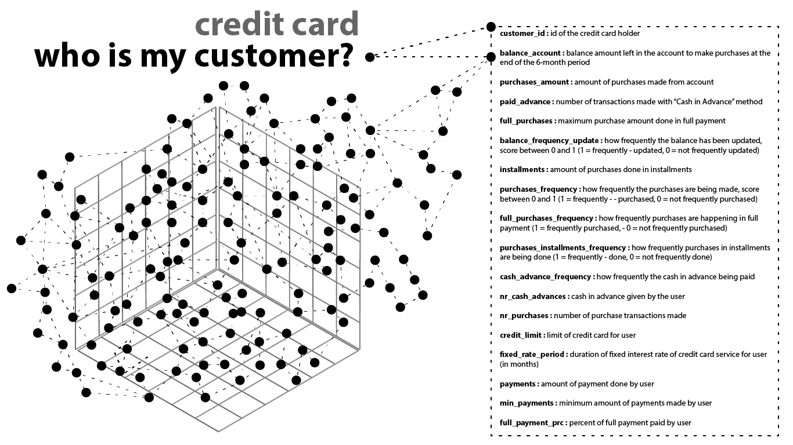

# Credit Card Customer Segments

Who are our costumers and how can we tailor our marketing campaigns to each customer segment?

#### -- Project Status: [Completed]

## Project Intro/Objective
This is a project to find out the most useful customer segmentation to improve the marketing campaigns of the credit card company.

### Partner
* [SIT Academy](https://sit.academy/)

### Methods Used
* Inferential Statistics
* Data Visualization
* Machine Learning
* Cluster Analysis

### Technologies
* Python
* Pandas, jupyter
* PyCaret
* Scikit-learn

## Project Description
The credit card transaction dataset contains 8500 customers and their activity over a 6-month period. Each transaction is characterized by 18 features that are briefly described below.
The main task was to understand customer behaviour and create meaningful segmentations in order to propose future marketing campaigns.  

#### The features:

* customer_id : id of the credit card holder
* balance_account : balance amount left in the account to make purchases at the end of the 6-month period
* purchases_amount : amount of purchases made from account
* paid_advance : number of transactions made with “Cash in Advance” method
* full_purchases : maximum purchase amount done in full payment
* balance_frequency_update : how frequently the balance has been updated, score between 0 and 1 (1 = frequently - updated, 0 = not frequently updated)
* installments : amount of purchases done in installments
* purchases_frequency : how frequently the purchases are being made, score between 0 and 1 (1 = frequently - - purchased, 0 = not frequently purchased)
* full_purchases_frequency : how frequently purchases are happening in full payment (1 = frequently purchased, - 0 = not frequently purchased)
* purchases_installments_frequency : how frequently purchases in installments are being done (1 = frequently - done, 0 = not frequently done)
* cash_advance_frequency : how frequently the cash in advance being paid
* nr_cash_advances : cash in advance given by the user
* nr_purchases : number of purchase transactions made
* credit_limit : limit of credit card for user
* fixed_rate_period : duration of fixed interest rate of credit card service for user (in months)
* payments : amount of payment done by user
* min_payments : minimum amount of payments made by user
* full_payment_prc : percent of full payment paid by user

## Detailed Reports
Report and visualizations are available [here](reports/)

## Getting Started

1. Clone this repo (for help see this [tutorial](https://help.github.com/articles/cloning-a-repository/)).
2. Raw Data is confidential,therefore not available in this repo.

3. Data processing/transformation scripts are being kept [here](notebooks/)

## Featured Notebooks/Analysis/Deliverables
* Cluster Segmentation using scikit-learn [Notebook/Clusteranalysis](notebooks/Clusteranalysis.ipynb)
* Cluster Segmentation using scikit-learn [Notebook/Customer_Analysis_with_PyCaret](notebooks/Customer_Analysis_with_PyCaret.ipynb)

## Contributing Members

**[Marlies Monch](https://github.com/mmonch)**

**[Sibel Yasemin Özgan](https://github.com/sibelyozgan)**
