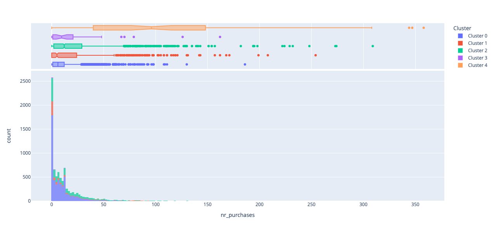
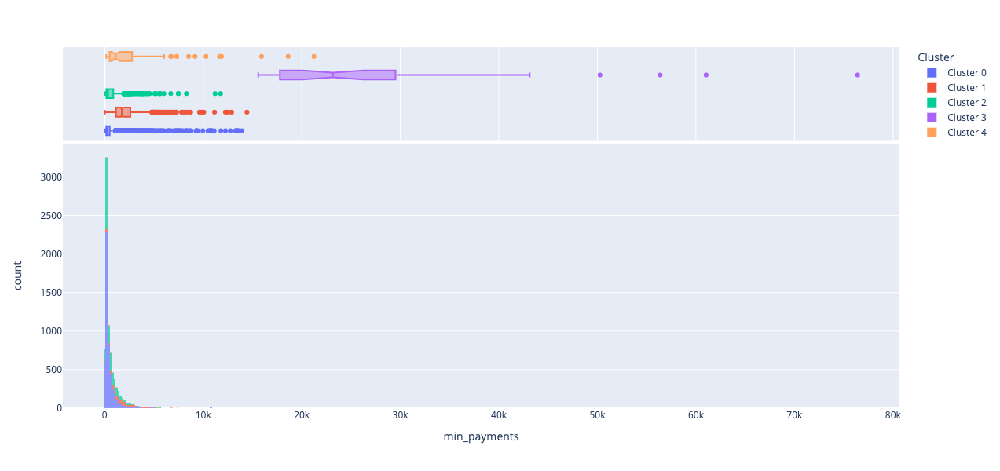

# Credit Card Customer Segments

# Summary

**Motivation:** The principal aim is to find valuable patterns among customers by investigating credit card transaction data

**Goal:** The goal is to separate users to meaningful segments

**What we propose:** We used cluster analyses and used two different approaches for that. The first approach uses scikit-learn pipelines to evaluate the possible clustering methods. The second approach uses PyCaret - an open-source, low-code machine learning method - that automizes the model making approach.
**Next Steps:** The customer clusters created are useful to predict which segment a given customer belongs to. This is useful to tailer focus and marketing.
**Structure of the document:** The report summarizes the approach. The steps in detail for each approach can be found in the related notebook.

# Introduction
The credit card transaction dataset contains 8500 customers and their activity over a 6-month period. Each transaction is characterized by 18 features that are briefly described below.
The main task was to understand customer behaviour and create meaningful segmentations in order to propose future marketing campaigns.  

#### The features:

* customer_id : id of the credit card holder
* balance_account : balance amount left in the account to make purchases at the end of the 6-month period
* purchases_amount : amount of purchases made from account
* paid_advance : number of transactions made with “Cash in Advance” method
* full_purchases : maximum purchase amount done in full payment
* balance_frequency_update : how frequently the balance has been updated, score between 0 and 1 (1 = frequently - updated, 0 = not frequently updated)
* installments : amount of purchases done in installments
* purchases_frequency : how frequently the purchases are being made, score between 0 and 1 (1 = frequently - - purchased, 0 = not frequently purchased)
* full_purchases_frequency : how frequently purchases are happening in full payment (1 = frequently purchased, - 0 = not frequently purchased)
* purchases_installments_frequency : how frequently purchases in installments are being done (1 = frequently - done, 0 = not frequently done)
* cash_advance_frequency : how frequently the cash in advance being paid
* nr_cash_advances : cash in advance given by the user
* nr_purchases : number of purchase transactions made
* credit_limit : limit of credit card for user
* fixed_rate_period : duration of fixed interest rate of credit card service for user (in months)
* payments : amount of payment done by user
* min_payments : minimum amount of payments made by user
* full_payment_prc : percent of full payment paid by user

# Part 1 Exploratory Data Analysis
The initial process started with exploratory data analysis. The focus here is to understand the features, their relations and whether missing values exist in the dataframe or not. This process helps to define which scaler and imputer must be taken into consideration.

A heatmap visualizes the correlation values among the features. Whereas values that are above 0.5 show considerable correlations, the visual shows that there are features that have values more than 0.8, pointing out highly correlations:   

Similarly, pairplot visualizes a scatter plot matrix for the dataset, as well as the histogram of each variable on the diagonal axes. As in the heatmap, this visualization shows strong linear relationships among some variables, highlighted by regression lines:

# Part 2 Clustering

We tested different methods for clustering. Among different models, K-means with 5 clusters appears to be the best method for partition. Using the distortion score elbow for KMeans Clustering, we can see the most efficient number (highlighted by the dashed vertical line) for the number of clusters:  

Each observation belongs to the cluster with the nearest mean. The distance plot:

Silhouette Plot:

Final clusters visualized in 3D space:

Number of customers in each Cluster:

# Part 3 Features for each Cluster in Detail  

After we have the Clusters and separations between our customers, we need to define why they are segmented into different groups. For that, we need to see the differences between the distribution of the features in each custer

* balance_account : balance amount left in the account to make purchases at the end of the 6-month period:

* purchases_amount : amount of purchases made from account

* paid_advance : number of transactions made with “Cash in Advance” method

* full_purchases : maximum purchase amount done in full payment

* balance_frequency_update : how frequently the balance has been updated, score between 0 and 1 (1 = frequently - updated, 0 = not frequently updated)

* installments : amount of purchases done in installments

* purchases_frequency : how frequently the purchases are being made, score between 0 and 1 (1 = frequently - - purchased, 0 = not frequently purchased)

* full_purchases_frequency : how frequently purchases are happening in full payment (1 = frequently purchased, - 0 = not frequently purchased)

* purchases_installments_frequency : how frequently purchases in installments are being done (1 = frequently - done, 0 = not frequently done)

* cash_advance_frequency : how frequently the cash in advance being paid

* nr_cash_advances : cash in advance given by the user

* nr_purchases : number of purchase transactions made

* credit_limit : limit of credit card for user

* fixed_rate_period : duration of fixed interest rate of credit card service for user (in months)

* payments : amount of payment done by user

* min_payments : minimum amount of payments made by user

* full_payment_prc : percent of full payment paid by user

# Conclusion & Recommendations

* Cluster 0
New customers (low tenures) who have a low balance and cash advance are segmented in this cluster. The credit card provider might encourage them to increase their activity by offering cash backs, promotions, temporary memberships in streaming platforms such as Netflix or Spotify

Cluster 1
Customers who have high balances and cash advances and one of the lowest purchase frequencies and percentages of full payments are in this cluster. This indicates that they are one of the most lucrative segments for the credit card provider. They are typically known as revolvers who might be using their credit card’s as a loan.
A revolver is a credit card issuer term for customers who carry balances, paying off those balances over time, thus “revolving” them. The opposite of the revolver is the “transactor” — people who pay their credit card balances each month, avoiding interest charges.* revolver

Cluster 2 
These customers have lowest balance and cash advances. Yet, they have a fairly high percentage of full payments. These customers are known as transactors. It might be a good idea to give them even more installment options, so that they are encouraged to purchase more.
In the credit card world, a transactor is a cardholder who transacts — that is, makes purchases with a credit card — but does not carry a balance and therefore pays no interest charges. The derisive term in the industry for transactor is “deadbeat.” The counterpart of a transactor is a “revolver” — one who uses the card and carries a balance, incurring interest charges. transactor

Cluster 3 
These are the moderate spenders. This group might be enticed to make more purchases by increasing their credit limit. This group is similar to the other deadbeats but different in that they are making purchases with credit card. In brief, this group isn’t as interesting to focus on.
You could give them more installment options, so that they are encouraged to purchase more.

Cluster 4
These are the customers with the highest credit limit and the highest percentage of full payments. These are the prime customers. By raising their credit limits even more, the credit card provider can encourage them to purchase more

write a paragraph on what should be done (further study, or actions...)

# References

- [this is a first link](https://www.google.com/)
- [this is another link](https://www.google.com/)
- [this is a third link](https://www.google.com/)